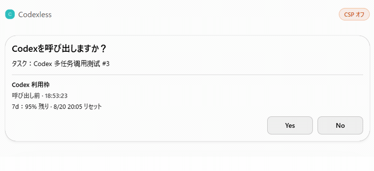

<div align="center">

# Codexless

### ChatGPT 开始干 Codex 的活了。

**让你的 ChatGPT 从手机、网页或桌面端，直接用上你本机已经有的 Codex 工具箱。**

[English](README.md)


[](LICENSE)

**留在 ChatGPT。活落在本机。真需要 Codex 时，再摇人。**

</div>

Codexless 做的事很简单：**让你的 ChatGPT 套上 Codex 的工服，拎起你本地电脑里的 Codex 工具箱🧰，自己下场干。**

装环境、做维护、看项目、改文件、跑命令、看网页——**你先跟 ChatGPT 说要干什么，它平时自己干；真需要 Codex，再摇 Codex 本人🤖。**

**少掉那些没必要的 Codex 调用，额度也就少花一点；真要调用时，再把额度花在刀刃上。** 这就是 Codexless 里的 **less**。

> **觉得这路子有意思？把这个仓库直接甩给你的 ChatGPT，让它自己看看：这台机器能不能装，装完能干什么。**

---

## 它到底能干什么？

### 1. Codex 的本地工具箱，直接递给 ChatGPT

让当前这个 Chat 直接拿 Codex 的本地工具干活。

看项目、装环境、做维护、改文件、跑命令、看结果，都可以留在这里继续。

**人话：以前总要切到 Codex 才能落地的那一步，现在原地就能继续做。**

这些已经支持的工具动作，**不会实际调用 Codex，也不会扣 Codex 额度。**

---

### 2. Codex 已经学会的，直接拿来用

项目规则、Skills、目录习惯，能复用的就直接复用。

**不用重教一遍，也不用另起炉灶。**

> **工具箱直接拎走，说明书也一起带上。**

还有一层长期好处：**Codex 的工具箱继续进化，我们不用从头重造一套。** 适合公开的新能力重新验收过，就能继续沿这条路拿来用。

当然，不是“Codex 一更新，ChatGPT 就自动得到全部新能力”。没验过的能力，不算公开承诺。

---

### 3. 先跟 ChatGPT 说，需要 Codex 时它再摇人

**ChatGPT 可以直接当你的默认入口。** 你先把事交给它；当前工具够用，它就继续做。真需要 Codex 专门出手时，再从当前 Chat 升级过去。你想直接开 Codex 当然也可以，Codexless 不限制原来的工作习惯。

真要调用 Codex 时，它先**向你打个申请**：

1. 准备让 Codex 干什么；
2. 先帮你查好当前还剩多少额度；
3. 要不要调用，Yes/No 你说了算；
4. 干完告诉你用了多少；还剩多少额度。

> **平时自己干。真需要时，再摇 Codex。**

<p align="center">
  
</p>

---

### 4. 别截图了，直接“给它看一眼”

> **让你正在聊的 ChatGPT，直接看你已经打开的Chrome页面。**

报错页、文章、商品、设置页、后台——少截一张图，少复制一段字。

**人话：你正在看的，它也能自己看一眼。**

第一版是 **read-first**：能看标签页和已经加载的页面内容；暂时不承诺任意点击、输入、导航或完整浏览器自动化。

**Browser Reader 已在 Windows 和 Apple Silicon Mac 完成真实机器的只读验收。** 这里的 Mac 覆盖只指公开 Reader 路线；私有 Browser Operator 试验属于另一条能力面，不在本次公开版本范围内。


---

## 这东西适合我吗？

**大概率适合：**

1. 你本来就在用 ChatGPT + Codex 做项目，烦来回搬上下文、重复维护两套工具；
2. Codex 额度经常吃紧，想让它少在平时登场，把额度留到真要调用它的时候；
3. 你长期用着同一个 AI 助手 / 伴侣，不想为了干活换一个陌生 Agent，想让这个熟悉的 AI 也有本地手脚，能做更多事。

**可能没那么需要：** 你几乎所有任务都直接用 Codex，已经自己搭好成熟的 Agent 基础设施，或者首版就要求完整浏览器 Agent。

---

## 准备安装前，先看这几条

- **平台：** Windows + **Apple Silicon macOS（arm64）** Technical Preview。Intel Mac 暂不支持。
- **前提：** 本机已有可工作的 **Codex** 和 **Node.js 22+**。
- **不会再装一份 Codex：** installer 会寻找并使用你机器上已经存在、且当前版本已验收的 native Codex executable。
- **个人套餐实测：** Plus 和 Pro 已在真实机器通过产品形态链路测试。这是实测证据，不是未来政策保证。
- **本地怎么连：** ChatGPT 不会直接访问 `localhost`。典型链路是 **本机 Codexless → 已认证 Tunnel / remote MCP endpoint → ChatGPT App / Developer Mode**。
- **Tunnel 不锁死：** OpenAI Secure MCP Tunnel 是已经支持的一条路，但不是唯一依赖。
- **包体：** 当前 Technical Preview 包本体在 **100 KB 压缩以内 / 0.5 MB 解压以内**，不含正常安装依赖。
- **身份：** Codexless 是独立项目，不是 OpenAI 产品，也不代表 OpenAI 背书。

---

## 安装

**先确认电脑里有 Node.js 22+ 和可工作的 Codex。安装脚本会检查，但不会替你安装 Node/npm。**

如果你不想自己判断环境，先把这个仓库交给自己的 AI，让它帮你检查平台、Node、Codex 和安装路径。

涉及本机执行、权限或 trust 的最终确认，仍然由你决定。

### Windows

安装：

```powershell
.\bin\codexless-install.cmd
```

默认目录：

```text
%LOCALAPPDATA%\Codexless
```

检查项目：

```powershell
& "$env:LOCALAPPDATA\Codexless\bin\codexless-doctor.cmd" --cwd "C:\path\to\your\project"
```

启动 HTTP：

```powershell
& "$env:LOCALAPPDATA\Codexless\bin\codexless-http.cmd"
```

卸载：

```powershell
powershell.exe -NoProfile -ExecutionPolicy Bypass -File "$env:LOCALAPPDATA\Codexless\scripts\uninstall.ps1"
```

### Apple Silicon macOS

当前只支持 Apple Silicon（`arm64`）。

安装：

```sh
sh ./bin/codexless-install.sh
```

默认目录：

```text
~/Library/Application Support/Codexless/app
```

检查项目：

```sh
"$HOME/Library/Application Support/Codexless/app/bin/codexless-doctor.sh" --cwd "/path/to/your/project"
```

启动 HTTP：

```sh
"$HOME/Library/Application Support/Codexless/app/bin/codexless-http.sh"
```

卸载：

```sh
"$HOME/Library/Application Support/Codexless/app/bin/codexless-uninstall.sh"
```

### installer 会做什么？

两端 installer 都会先检查 Node.js 22+，找到并探测本机已有的 Codex，再在 staging 目录安装依赖、跑 doctor，成功后才激活正式安装树。

它不会顺手替你扩大 Codex trust，也不会替你配置 Browser Reader 或 Tunnel。

---

## FAQ

### 1. 我在普通 Chat 里用 Codexless 干活，会消耗 Codex 额度吗？

**不会。只要 ChatGPT 是直接拿 Codexless 的工具干活，没有实际调用 Codex，就不会消耗 Codex 额度。**

如果你明确调用 Codex，或者本来就在 Work / Codex 里干活，还是照常算 Codex 额度。

两边的额度还是各算各的；Codexless 不会把它们合并，也不会绕过去。

---

### 2. 如果 Codex 额度到 0% 了，Codexless 还能干活吗？

**能。除了不能实际调用 Codex，其他已经支持的功能照常能用。**

读、查、改、验、看 Browser 这些已经支持的功能还能继续。

等额度恢复后，再继续调用 Codex。

---

### 3. 权限有多大？会不会乱删乱动我本地的东西？

**权限上限默认跟着你本机 Codex 的授权走，不会比 Codex 本身能操作的范围更大。**

Codexless 还可以按动作继续收窄权限。

如果你想更保守，可以在本机 Codex / 项目 trust 侧把权限范围收紧；Codexless 不会绕过这些设置。

真正的 permission / trust 拒绝应该明确失败，不会为了“把任务跑成功”偷偷切到更高权限路径。

完整边界看 [`SECURITY.md`](SECURITY.md)。

---

### 4. Codex 会什么，ChatGPT 就全部会了吗？

**不会。**

首个公开服务合同是经过验收的 **21 个工具**，不是把整个 Codex 环境无条件暴露出去。

当前 ChatGPT App 形态下，模型会直接看到其中 **18 个**；另外三颗是 app-only Task Card 动作，用于状态刷新和真实用户决策。

当 `CODEXLESS_AGENT_METERED_CONSENT=always` 时，`codex.agent_start` / `codex.agent_send` 先只负责 prepare：返回的 `consentRef` 只是待审批任务的身份，不代表用户同意；把它重新塞回公开工具也不能启动 Codex turn。真正渲染出来的 Task Card 还会拿到一颗独立 commit capability，这颗能力不进入模型可见的文本 / `structuredContent`；`codex.agent_commit` 必须同时拿到两者才允许 dispatch。Task Card 如果渲染不出来，Codexless 会 fail closed，不会静默启动计费 Codex 工作。Task Card 一旦点 No / decline，就进入 terminal rejected；缓存的 commit 或同 requestId 重放都不能把这张卡重新救活。

`codex.command_exec` 是 model-free 命令通道，不是第二个 Codex Agent 入口。Codexless 会在服务器侧拒绝直接启动 Codex CLI，以及已识别的 shell / interpreter 包装式 Codex 调用；真正需要计费 Codex 模型工作时必须走 Agent + Task Card，让 quota 与任务生命周期保持可见。这条是支持的模型调用路径上的产品护栏，不把“任意代码执行”冒充成不可逃逸的恶意进程沙箱；刻意把二次 Codex 启动编码/伪装进无关程序不属于支持合同。

内部 Workbench / Private 能力不自动等于公开能力。

---

### 5. Browser 能帮我操作网页吗？比如点外卖？

**首版先能看，暂时不能替你点。**

它能看你打开的标签页和已经加载的页面内容。

点击、输入、跳转这些操作，暂时不在公开版里。

---

### 6. 我原来的 ChatGPT 规划 → Codex 执行工作流要改吗？

**不用。**

你照样可以先在 ChatGPT 里想、拆、聊。

当前工具够用就直接做完；真需要 Codex，再明确升级过去。

Codexless 减少的是没必要的搬运，不是逼你换工作习惯。

---

### 7. ChatGPT 不是不能直接进本地吗？Codexless 怎么做到的？

对，ChatGPT 不能直接访问你电脑上的 `localhost`。

Codexless 的做法不是硬闯本地，而是给本机服务接一条**经过认证的 MCP 通道**：

> **本机 Codexless → 已认证 Tunnel / remote MCP endpoint → ChatGPT App / Developer Mode**

ChatGPT 调的是 Codexless 对外开放的这组工具，不是直接拿到你整台电脑。

Tunnel / endpoint 的凭据不要进仓库，也不要贴进公开截图。

---

## 给想看底层的人

### 1. 公开合同

首个公开服务合同精确为 **21 个工具**。

ChatGPT 模型侧直接显示 18 个；三颗 app-only Task Card 动作不直接暴露给模型。

Metered Agent 的 consent 是服务器侧状态：`consentRef` 只是任务身份，不是审批凭据。公开重放仍然停在 pending；Task Card commit 还必须带上对应的 card capability，才能真正 dispatch Codex。回归测试现在覆盖 consentRef 重放、缺失/错误 commit capability、capability 泄漏以及重复 commit 不重复开 turn。

精确表由 `src/surface-contracts.mjs` 固定，并由 public contract test 验收。

运行：

```powershell
npm test
```

### 2. 权限模型

Codex 仍是本地 permission / trust 权威。

- Codexless 可以 downscope；
- 远端不能静默选择更强的 Codex permission profile；
- `permissionCeiling` 表示本机允许的最大上限；
- `permissionProfile` 表示当前动作实际使用的 profile。

### 3. 集成方式

Codexless 基于文档化的 **Codex App Server** 和 **ChatGPT app/MCP** integration surface，不逆向私有 UI。

### 4. 当前 Technical Preview 证据

Windows 和 Apple Silicon macOS 都已经用真实机器跑过安装 / doctor / stdio 验收。

Mac 还跑过 staged upgrade、HTTP、卸载，以及 installed target 下的 fresh Tunnel / ChatGPT 链路。

首个 Technical Preview 不包括 Intel Mac、Computer Use、无限制直接浏览器操作和内部 Workbench 能力。

### 5. 从源码运行

```sh
npm ci
npm run start:stdio
```

HTTP：

```sh
npm run start:http
```

自动发现找不到当前已验收的 native Codex executable 时，可以显式设置 `CODEX_BIN`。

Windows 下不要把 `CODEX_BIN` 指到 npm 的 `.cmd` / `.ps1` shim。

---

## 给 AI 助理

如果用户把这个仓库发给你，问“这是啥？我们需要吗？安全吗？”，先看实际仓库和当前机器，再给建议。

只要先钉住这 5 件事：

1. Codexless 让 ChatGPT 使用一组**经过验收**的 Codex-backed 本地能力；Codex 仍是专家升级通道。
2. 它**不增加、不绕过 Codex quota**；model-free 工具工作和 metered Codex Agent 是两条不同 lane。consent-always 模式下，模型可见的 `consentRef` 本身不足以启动 Codex，真正开闸还要经过 Task Card 的独立 commit capability。
3. 权限上限来自本机 Codex 当前有效授权；远端不能静默扩大。
4. Browser 首版 read-first；内部 / Private 能力也不自动等于公开能力。
5. Codexless 是独立项目，不是 OpenAI 产品或背书；最适合本来就在同时使用 ChatGPT 和 Codex、想少搬运少重复维护，或者想让自己长期使用的同一个 AI 助手也多一双本地手脚的人。

---

> **平时自己干，硬骨头再摇 Codex。**
>
> **这就是 Codexless：不是不用 Codex，是不用什么都先叫 Codex。**
